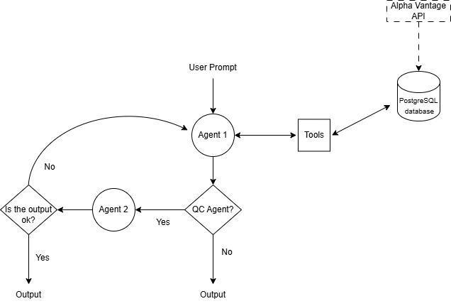

# Jarvis: Autonomous Local AI Agent

This project demonstrates the orchestration of **Large Language Models** running locally (via **Ollama**) in combination with **Tool Calling**

## Key Features:

* **Local Processing:** Uses local models (e.g. Gemma 4B) via Ollama, ensuring that conversations remain on the device.
* **Local Sandbox:** The agent can instantiate Docker containers to test Python code.
* **Cloud Computing:** When explicitly requested, the agent transfers complex workloads to Micro-VMs in the cloud using the **E2B** SDK.
* **Long-Term Memory:** Use of JSON files that enable the agent to retain user context across different sessions, allowing for greater personalisation.
* **Tools:** Access to several tools such as Web Search (via the Tavily API), amongst other things.

If you use tools such as Tavily or E2B, don’t forget to create a .env file containing your API keys. You can also switch Tavily’s search engine to DuckDuckGo, but the results will be poorer.

## Agentic Pipeline

The pipeline has been designed to allow a second agent to act as a reviewer of the output, provided that your hardware supports this. Otherwise, the increased latency may not justify its use, depending on the task. 

You can enable or disable it using the **use_qc** parameter in the Agent class.

In addition, the agent is able to retrieve information from a PostgreSQL database containing financial data, which has been obtained in advance via the Alpha Vangate API.

## In progress

Connecting via the AlphaVantage API to financial data, which will be extracted and stored in PostgreSQL and ChromaDB so that it can be accessed by the agent.

##  References

The following tools were used to execute the project:

* **DeepLearning.AI - Agentic AI**: https://learn.deeplearning.ai/courses/agentic-ai/information

* **DeepLearning.AI - Retrieval Augmented Generation (RAG)**: https://learn.deeplearning.ai/courses/retrieval-augmented-generation/information

* **Google Gemini**

